# InternRadar v2: System Architecture (design only, greenfield)

The product decisions that settle this design's open questions are recorded in [decisions.md](decisions.md). Where the two documents differ, the decision log wins. Each ADR in §8 also has its own file in [`docs/adr/`](../adr/README.md).

Tags used on every component:
- **[MVP]**: phases 0-4.
- **[P5-6]**: post-MVP pipeline work (monitor, alerts, eval).
- **[v2]**: phase 7 and later.

Any item marked **(VERIFY)** is a vendor-specific or version-specific claim. Check it against current docs before relying on it.

---

## 0. Headline recommendations

1. **All writes to the shared catalog go through two paths only**: curated seed files (reviewed in a PR) and the approval function. Workers never write `programs` or `program_windows` directly. The monitor worker only writes observations (fetches, snapshots, extractions). A security-definer DB function (`approve_extraction`) turns an approved observation into history plus change events, all in one transaction.
2. **No service-role key in the workers.** Each worker gets its own Postgres login role, connecting through the Supabase pooler, with only the grants it needs. The service-role key exists in exactly one place: a server-only module on Vercel that performs account deletion.
3. **The database is the queue.** Status columns plus `FOR UPDATE SKIP LOCKED` plus unique "claim" rows. GitHub Actions cron runs the jobs. No Redis, no queue service, no Inngest.
4. **The eligibility engine is TypeScript only.** Python never evaluates eligibility. Python only emits eligibility rules as JSON. That JSON is validated against a JSON Schema generated from the Zod schema in `packages/domain`, and a CI check fails if the two drift apart.
5. **Year level is modelled as "semesters remaining", not as labels.** "Penultimate" and "pre-penultimate" are presets over a semester count computed from the graduation month and the *window's* program start date. This is what makes mid-year graduation and double degrees solvable.
6. **Scope adjustment inside Phase 3 (not relitigating it).** Most of the seed employers (Big 4, banks, APS, probably Optiver/IMC) run graduate programs on bespoke career pages rather than Greenhouse/Lever. So Phase 3 should ship:
   - a **curated seed source** (CSV/YAML in the repo, PR-reviewed) for programs and historical windows;
   - Greenhouse and Lever adapters only for employers confirmed on those ATSs;
   - Workday deferred until a ToS/robots review is done (see Risks).

   The monitor pipeline (P5), not ATS ingest, is where most of the value comes from.

---

## 1. System context, components, trust boundaries

```
                               UNTRUSTED INTERNET
 +---------------------------+                    +-----------------------------------+
 | Browser (Next.js client)  |                    | Employer career pages, public ATS |
 | holds: user session JWT   |                    | feeds (Greenhouse/Lever [MVP],    |
 |        (httpOnly cookie), |                    | Workday [deferred])               |
 |        Supabase publish-  |                    | = UNTRUSTED INPUT (prompt-injection|
 |        able/anon key      |                    |   surface for the LLM)            |
 +------+-------------+------+                    +-----------------^-----------------+
        |             | Supabase Auth only                          | polite GET: robots.txt,
        | /api/v1/*   | (magic link / OAuth)                        | <=1 claim per URL per
========|=TB1=========|=============================================|= Melbourne day, per-host
        v             v                                             |  rate limit, identified UA
 +-----------------------------+      +-------------------------------+   +--------------------------------+
 | Vercel: apps/web  [MVP]     |      | Supabase                      |   | GitHub Actions  (TB3)          |
 |  - RSC pages + /api/v1      |      |  Auth (JWT issuer)            |   |  ingest.yml   -> workers/ingest|
 |  - Zod validation           | TB2  |  Postgres 15+ w/ RLS          |pg |     role: ingest_worker [MVP]  |
 |  - packages/domain (TS)     |----->|  Storage: private 'resumes'   |<--|  monitor.yml  -> workers/monitor|
 |  - user-scoped Supabase     | user |   bucket (ciphertext only)    |via|     role: monitor_worker [P5]  |
 |    client (anon key + JWT)  | JWT  |  Security-definer RPCs:       |poo|  dispatch.yml -> apps/web/     |
 |  - resume envelope crypto   |      |   approve_extraction,         |ler|     scripts/dispatch.ts        |
 |  - SERVICE ROLE KEY: only   |      |   log_event, is_admin,        |   |     role: alert_dispatcher[P5] |
 |    in server/admin/         |      |   alert_recipients            |   |  ci.yml, purge.yml, eval.yml   |
 |    deleteAccount.ts         |      +-------------------------------+   |  secrets: per-role DB URLs,    |
 +-----------------------------+                                          |  LLM_API_KEY, RESEND_API_KEY   |
                                                                          +------+------------------+------+
                                                                        TB4      |                  |   TB4
                                                                   +-------------v---+   +----------v------+
                                                                   | LLM provider    |   | Resend (email)  |
                                                                   | (deferred; stub)|   | [P5]            |
                                                                   | public page text|   | alert.id as     |
                                                                   | ONLY, never PII |   | idempotency key |
                                                                   +-----------------+   +-----------------+
```

### Trust boundaries

| Boundary | What crosses it | Enforcement |
|---|---|---|
| TB1 browser to Vercel/Supabase Auth | Session cookie; JSON bodies; resume uploads | Zod on every route. Origin check and JSON content-type required on mutating routes (CSRF). SameSite=Lax cookies. Resume magic-byte and size checks. The browser **never** queries PostgREST for data. It only talks to Supabase Auth for sign-in. |
| TB2 Vercel to Postgres | User JWT (anon key + access token) | **RLS is the primary control.** API code runs as the user, so a bug in route code cannot read another user's rows. |
| TB3 GitHub Actions to Postgres | Per-role Postgres connection strings | Dedicated login roles. Grants are restricted to catalog/pipeline tables, with **no grants on user tables** except the dispatcher's narrow read path. |
| TB4 to third parties | Public page text to the LLM; recipient email plus alert body to Resend | No PII to the LLM. Resend receives only email address and message. Employer HTML is treated as hostile (see §3 and §6). |

### Credential inventory (the answer to "who holds what")

| Secret | Location | Used for |
|---|---|---|
| Supabase URL + publishable/anon key | Browser and Vercel | Auth and user-scoped queries. Safe to expose because RLS applies. (Supabase is migrating from "anon/service_role" to "publishable/secret" keys: **VERIFY** naming and behaviour.) |
| Service-role / secret key | Vercel env only, imported only by `apps/web/src/server/admin/deleteAccount.ts` (which carries a `server-only` import guard) | `auth.admin.deleteUser`. A lint rule bans importing it anywhere else. |
| `INGEST_DATABASE_URL` (role `ingest_worker`) | GitHub Actions secret | Ingest worker |
| `MONITOR_DATABASE_URL` (role `monitor_worker`) | GitHub Actions secret | Monitor worker |
| `DISPATCH_DATABASE_URL` (role `alert_dispatcher`) | GitHub Actions secret | Alert fan-out and send |
| `RESUME_KEK_V1` (32 random bytes, base64) | Vercel env only | Wraps per-resume data keys |
| `LLM_API_KEY` | GitHub Actions secret | Monitor extraction |
| `RESEND_API_KEY` | GitHub Actions secret. Also configured as Supabase Auth SMTP. | Alerts and auth emails |
| `ALERT_LINK_SIGNING_KEY` | Vercel + GitHub Actions | HMAC for unsubscribe and "was this correct?" links |

**How Python workers authenticate.** They use a direct Postgres connection with psycopg 3 through the Supavisor pooler (session mode) as a custom login role. They do not use supabase-py with the service key.
- **VERIFY**: whether the pooler supports custom roles (username format `role.projectref`).
- **VERIFY**: the direct connection is IPv6-only on the free tier, and GitHub-hosted runners generally have no IPv6, so use the pooler.
- **VERIFY**: in transaction mode, prepared statements must be disabled (`prepare_threshold=None`).
- Role passwords are set out-of-band (SQL editor) and **never** put in migrations.

### Component list and tags

| Component | Tag |
|---|---|
| `apps/web`: auth, listings feed, eligibility badge, tracker, resume versions, profile, `/api/v1` | MVP |
| `apps/web` admin review UI (`/admin/review`) | P5 |
| `apps/web/scripts/dispatch.ts` (TS alert fan-out and send, run by GitHub Actions) | P5 |
| `packages/domain`: eligibility, academic calendar, application status machine, Zod schemas + JSON Schema export | MVP |
| `packages/domain`: alert policy (`shouldAlert`), timeline prediction, requirement/gap matching | P5 / v2 / v2 |
| `packages/db`: migrations, generated types, pgTAP RLS tests, seed catalog | MVP |
| `workers/common` (Python: polite fetcher, robots cache, host rate limiter, db helpers, structlog with redaction) | MVP |
| `workers/ingest`: Greenhouse + Lever adapters, seed loader, dedupe | MVP |
| `workers/ingest`: Workday adapter | Deferred (post-MVP, pending ToS review) |
| `workers/monitor`: fetch, normalize, hash, extract, auto-approve gate | P5 |
| `eval/`: labelled fixtures + scorer | P6 |
| Telegram notifier | v2 |

`workers/common` is a small addition to the fixed layout (a uv workspace member). Without it, `ingest` and `monitor` would duplicate the politeness logic, which is the ethics-critical code. I recommend it; if you would rather not add it, put it under `workers/ingest/common` and import it from monitor.

---

## 2. Data model (DDL-level)

Conventions:
- `uuid` PKs via `gen_random_uuid()`; `bigint identity` for append-only logs.
- `timestamptz` stored in UTC; calendar dates as `date`, interpreted in `Australia/Melbourne`.
- Every table in `public` has RLS enabled. A CI assertion fails the build if any table has `rowsecurity = false`.
- Every user table cascades from `auth.users`.

### 2.1 Enums

```sql
create extension if not exists citext;

create type program_type      as enum ('internship','vacationer','graduate','cadetship','discovery');
create type window_status     as enum ('upcoming','open','closed','unknown');
create type date_precision    as enum ('day','month','estimated');
create type provenance        as enum ('seed','ats','monitor','admin');
create type ats_kind          as enum ('greenhouse','lever','workday');
create type app_status        as enum ('saved','applied','online_assessment','interview','offer','rejected');
create type alert_type        as enum ('window_opened','closing_soon_7d','closing_soon_1d','dates_changed');
create type alert_status      as enum ('pending','sending','sent','failed','dead','suppressed');
create type extraction_status as enum ('pending_review','auto_approved','approved','rejected','superseded','failed');
create type citizenship       as enum ('au_citizen','au_pr','nz_citizen','intl_student','other');
create type degree_level      as enum ('undergraduate','honours','masters_coursework','masters_research','phd');
create type accuracy_label    as enum ('accurate','inaccurate','unverified');
```

### 2.2 Catalog [MVP]

Public read. Writable only by seed migrations, worker roles and admin RPCs.

```sql
create table companies (
  id          uuid primary key default gen_random_uuid(),
  slug        citext not null unique,
  name        text   not null,
  careers_url text   not null,
  created_at  timestamptz not null default now()
);

create table programs (
  id                        uuid primary key default gen_random_uuid(),
  company_id                uuid not null references companies on delete restrict,
  slug                      citext not null,
  name                      text not null,
  program_type              program_type not null,
  cities                    text[] not null default '{melbourne}',
  disciplines               text[] not null default '{}',     -- controlled vocab, see §4
  source_url                text not null,                    -- link to original; we never republish
  eligibility_rules         jsonb not null default '{"schemaVersion":1}'
                            check (jsonb_typeof(eligibility_rules) = 'object'),
  eligibility_rules_version int  not null default 1,
  eligibility_verified_at   timestamptz,                      -- null => engine returns 'unknown'
  is_published              boolean not null default false,
  created_at timestamptz not null default now(),
  updated_at timestamptz not null default now(),
  unique (company_id, slug)
);
create index programs_published_idx on programs (program_type) where is_published;

create table program_windows (
  id                     uuid primary key default gen_random_uuid(),
  program_id             uuid not null references programs on delete cascade,
  cycle_year             smallint not null check (cycle_year between 2015 and 2100), -- year the program STARTS
  window_seq             smallint not null default 1 check (window_seq between 1 and 9), -- multiple rounds per cycle
  opens_on               date,
  opens_precision        date_precision,
  closes_on              date,
  closes_precision       date_precision,
  program_starts_on      date,          -- first of month; eligibility is computed against THIS
  program_ends_on        date,
  status                 window_status not null default 'unknown',
  first_observed_open_at timestamptz,   -- when WE first saw it open (latency metric)
  provenance             provenance not null,
  source_url             text not null,
  last_verified_at       timestamptz,
  created_at timestamptz not null default now(),
  updated_at timestamptz not null default now(),
  unique (program_id, cycle_year, window_seq),
  check (opens_on is null or closes_on is null or closes_on >= opens_on),
  check ((opens_on is null) = (opens_precision is null)),
  check ((closes_on is null) = (closes_precision is null))
);
create index program_windows_active_idx on program_windows (closes_on) where status in ('upcoming','open');

-- Append-only history: this, not program_windows, is the timeline's source of truth over time
create table program_window_events (
  id                bigint generated always as identity primary key,
  program_window_id uuid not null references program_windows on delete cascade,
  event_type        text not null check (event_type in
                      ('created','opened','closed','dates_changed','corrected','rules_changed')),
  before            jsonb,
  after             jsonb not null,
  extraction_id     uuid,                            -- FK added after extractions exists
  actor             provenance not null,
  occurred_at       timestamptz not null default now()
);
create index pwe_window_time_idx on program_window_events (program_window_id, occurred_at);
```

**Is `program_windows` history sufficient for the timeline?** Not as a bare open/close table. It becomes sufficient with the additions above:
- `window_seq`: Deloitte-style multiple rounds per year.
- `*_precision`: separates "opens in Feb" (month) from "opens 3 Feb" (day). Without it, predictions look falsely exact.
- `program_starts_on`: eligibility depends on the window's start date, not the program's.
- `first_observed_open_at`: needed for latency measurement.
- `program_window_events`: an append-only record of revisions and corrections. Without it, "close date extended from 10 to 17 Mar" is lost, and alert accuracy cannot be scored.
- `provenance` + `source_url`: needed for the historical backfill.

The v2 timeline prediction is a **pure TS function** over this history (`predictWindows(history) -> {expectedOpenMonth, confidence, basis: n cycles}`). It is computed at read time. Do not store predictions (YAGNI). The historical backfill of 1-2 past cycles is manual and goes in as seed rows with `provenance='seed'` and a citation in `source_url`.

### 2.3 ATS ingestion [MVP]

```sql
create table ats_sources (
  id         uuid primary key default gen_random_uuid(),
  company_id uuid not null references companies on delete cascade,
  kind       ats_kind not null,
  board_key  text not null,               -- greenhouse board token / lever site / workday tenant+site
  is_active  boolean not null default true,
  unique (kind, board_key)
);

-- One claim per source per Melbourne day (same politeness rule as pages)
create table ats_fetches (
  id            bigint generated always as identity primary key,
  ats_source_id uuid not null references ats_sources on delete cascade,
  fetch_day     date not null,
  run_id        uuid not null,
  http_status   smallint,
  is_complete   boolean not null default false,   -- full board parsed successfully
  error         text,
  fetched_at    timestamptz not null default now(),
  unique (ats_source_id, fetch_day)
);

create table listings (
  id             uuid primary key default gen_random_uuid(),
  ats_source_id  uuid not null references ats_sources on delete cascade,
  external_id    text not null,
  program_id     uuid references programs on delete set null,  -- linked by title rules or admin
  title          text not null,
  location       text,
  url            text not null,                                -- original listing
  posted_at      timestamptz,                                  -- ATS-provided, used for true latency
  key_facts      jsonb not null default '{}',                  -- key facts only, never full description
  content_hash   text not null check (content_hash ~ '^[0-9a-f]{64}$'),
  dedupe_key     text not null,          -- sha256(company_id|normalized_title|normalized_location)
  first_seen_at  timestamptz not null default now(),
  last_seen_at   timestamptz not null default now(),
  closed_at      timestamptz,
  unique (ats_source_id, external_id)
);
create index listings_dedupe_idx  on listings (dedupe_key);
create index listings_program_idx on listings (program_id) where closed_at is null;

create table listing_program_rules (    -- deterministic linking, curated
  id          uuid primary key default gen_random_uuid(),
  company_id  uuid not null references companies on delete cascade,
  title_regex text not null,
  program_id  uuid not null references programs on delete cascade,
  unique (company_id, title_regex)
);
```

**Idempotency key: a correction to the brief.** Uniqueness must be on `(ats_source_id, external_id)`, which covers source + board + id. Workday ids are only unique per tenant, so `source + external_id` alone is not enough.

**Do not put `content_hash` in the unique key.** If content is part of the identity, a legitimately edited listing inserts a new row, which is exactly the duplicate you are trying to prevent. The content hash drives change detection:

```sql
insert into listings (...) values (...)
on conflict (ats_source_id, external_id) do update
  set title = excluded.title, location = excluded.location, url = excluded.url,
      key_facts = excluded.key_facts, content_hash = excluded.content_hash,
      posted_at = coalesce(listings.posted_at, excluded.posted_at), closed_at = null
  where listings.content_hash is distinct from excluded.content_hash
returning id, (xmax = 0) as inserted;
-- then one bulk: update listings set last_seen_at = now() where id = any($seen_ids)
```

**Closing listings.** Mark `closed_at` on listings not seen in this run **only if** the run's `ats_fetches.is_complete = true`. That stops a partial or failed fetch from mass-closing a board.

**Cross-source dedupe.** `dedupe_key` is indexed but not unique. The same role on two boards gets flagged in the feed query (`distinct on (dedupe_key)`); it is not merged. Clustering or merging is [v2] and only if it proves necessary.

### 2.4 Monitor pipeline [P5]

```sql
create table monitored_pages (
  id                   uuid primary key default gen_random_uuid(),
  url                  text not null unique,             -- normalized (lowercase host, no fragment/tracking params)
  host                 text not null,
  content_selector     text,                             -- optional CSS scope to cut noise
  is_active            boolean not null default true,
  etag                 text,
  last_modified        text,
  last_content_hash    text,
  consecutive_failures smallint not null default 0,
  next_fetch_after     timestamptz not null default now(),  -- backoff for 403/429
  created_at timestamptz not null default now()
);
create table page_programs (             -- one page can describe several programs (Big 4)
  page_id    uuid references monitored_pages on delete cascade,
  program_id uuid references programs on delete cascade,
  primary key (page_id, program_id)
);

create table page_fetches (              -- THE at-most-once-per-day enforcement
  id           bigint generated always as identity primary key,
  page_id      uuid not null references monitored_pages on delete cascade,
  fetch_day    date not null,           -- (now() at time zone 'Australia/Melbourne')::date
  run_id       uuid not null,
  attempts     smallint not null default 0 check (attempts <= 3),
  http_status  smallint,
  outcome      text check (outcome in ('unchanged','changed','not_modified','blocked',
                                       'gone','robots_disallowed','network_error','http_error')),
  content_hash text,
  fetched_at   timestamptz,
  unique (page_id, fetch_day)
);

create table page_snapshots (
  id           uuid primary key default gen_random_uuid(),
  page_id      uuid not null references monitored_pages on delete cascade,
  fetch_id     bigint not null unique references page_fetches on delete cascade,
  content_hash text not null,
  norm_text    text,                     -- normalized main text; purged after 90 days (null-ed)
  byte_len     int not null,
  created_at   timestamptz not null default now()
);

create table extractions (
  id                uuid primary key default gen_random_uuid(),
  snapshot_id       uuid not null references page_snapshots on delete cascade,
  page_id           uuid not null references monitored_pages on delete cascade,
  program_id        uuid references programs,           -- resolved target
  provider          text not null,
  model             text not null,
  prompt_version    text not null,
  schema_version    smallint not null,
  output            jsonb,                               -- null on failure
  field_confidence  jsonb not null default '{}',
  confidence        numeric(4,3) check (confidence between 0 and 1),
  status            extraction_status not null default 'pending_review',
  error             text,
  input_tokens int, output_tokens int, latency_ms int,
  reviewed_by       uuid references auth.users on delete set null,
  reviewed_at       timestamptz,
  review_patch      jsonb,                               -- reviewer edits => online accuracy signal
  created_at        timestamptz not null default now(),
  unique (snapshot_id, program_id, prompt_version, model)   -- re-runs never duplicate
);
create index extractions_review_idx on extractions (created_at) where status = 'pending_review';

alter table program_window_events
  add constraint pwe_extraction_fk foreign key (extraction_id) references extractions on delete set null;

create table change_events (             -- outbox between approval and alert fan-out
  id                uuid primary key default gen_random_uuid(),
  program_window_id uuid not null references program_windows on delete cascade,
  change_type       text not null check (change_type in ('window_opened','dates_changed','window_closed','rules_changed')),
  extraction_id     uuid references extractions on delete set null,
  payload           jsonb not null,
  created_at        timestamptz not null default now(),
  fanned_out_at     timestamptz,
  unique (extraction_id, change_type)
);
create index change_events_pending_idx on change_events (created_at) where fanned_out_at is null;
```

There is no separate review-queue table. The queue is `extractions where status='pending_review'` (YAGNI).

### 2.5 User data [MVP unless tagged]

All user tables reference `auth.users(id) on delete cascade`.

```sql
create table profiles (
  user_id             uuid primary key references auth.users on delete cascade,
  expected_graduation date check (extract(day from expected_graduation) = 1), -- month precision
  degree_level        degree_level,
  disciplines         text[] not null default '{}',     -- union across double degrees
  is_double_degree    boolean not null default false,
  citizenship         citizenship,                      -- sensitive; never logged/exported to metrics
  university          text,
  email_alerts        boolean not null default true,
  created_at timestamptz not null default now(),
  updated_at timestamptz not null default now()
);

create table program_follows (
  user_id    uuid not null references auth.users on delete cascade,
  program_id uuid not null references programs on delete cascade,
  notify     boolean not null default true,
  created_at timestamptz not null default now(),
  primary key (user_id, program_id)
);
create index follows_program_idx on program_follows (program_id) where notify;

create table resumes (
  id           uuid primary key default gen_random_uuid(),
  user_id      uuid not null references auth.users on delete cascade,
  label        text not null check (char_length(label) between 1 and 60),
  version      int  not null,
  storage_path text not null unique,          -- '{user_id}/{id}.bin'
  mime_type    text not null check (mime_type in ('application/pdf',
               'application/vnd.openxmlformats-officedocument.wordprocessingml.document')),
  size_bytes   int  not null check (size_bytes between 1 and 2097152),
  sha256       text not null,                  -- of plaintext
  wrapped_dek  bytea not null,
  iv           bytea not null,
  kek_version  smallint not null,
  skills       jsonb,                          -- [v2] structured extracted skills only
  created_at   timestamptz not null default now(),
  archived_at  timestamptz,                    -- soft-archive keeps tracker history intact
  unique (user_id, version),
  unique (id, user_id)                         -- target for composite FK
);

create table applications (
  id                uuid primary key default gen_random_uuid(),
  user_id           uuid not null references auth.users on delete cascade,
  program_id        uuid not null references programs on delete restrict,
  program_window_id uuid references program_windows on delete set null,
  cycle_year        smallint not null,
  resume_id         uuid,
  status            app_status not null default 'saved',
  applied_at        timestamptz,
  notes             text check (char_length(notes) <= 2000),
  created_at timestamptz not null default now(),
  updated_at timestamptz not null default now(),
  unique (user_id, program_id, cycle_year),
  unique (id, user_id),
  foreign key (resume_id, user_id) references resumes (id, user_id),  -- cannot attach another user's resume
  check (status = 'saved' or applied_at is not null)
);
create index applications_user_idx on applications (user_id, status);

create table application_events (          -- funnel + time-to-apply source
  id             bigint generated always as identity primary key,
  application_id uuid not null,
  user_id        uuid not null,
  from_status    app_status,
  to_status      app_status not null,
  resume_id      uuid,                      -- snapshot of version at transition
  occurred_at    timestamptz not null default now(),
  foreign key (application_id, user_id) references applications (id, user_id) on delete cascade
);
create index app_events_user_idx on application_events (user_id, occurred_at);

create table app_admins (user_id uuid primary key references auth.users on delete cascade);
```

Resumes attached to an application are archived rather than deleted, and the composite FK has no `on delete` action (it restricts), so the per-application record of "which version was sent" survives. The full account-deletion path cascades everything.

### 2.6 Alerts [P5]

```sql
create table alerts (
  id                  uuid primary key default gen_random_uuid(),
  user_id             uuid not null references auth.users on delete cascade,
  program_window_id   uuid not null references program_windows on delete cascade,
  alert_type          alert_type not null,
  change_event_id     uuid references change_events on delete set null,
  channel             text not null default 'email' check (channel in ('email','telegram')),
  status              alert_status not null default 'pending',
  attempts            smallint not null default 0,
  next_attempt_at     timestamptz not null default now(),
  locked_at           timestamptz,
  provider_message_id text,
  last_error          text,
  accuracy            accuracy_label not null default 'unverified',
  accuracy_source     text check (accuracy_source in ('user_feedback','reconciliation','audit')),
  created_at          timestamptz not null default now(),
  sent_at             timestamptz
);
-- Idempotency: brief's key for once-per-window types
create unique index alerts_once_per_window_uq
  on alerts (user_id, program_window_id, alert_type)
  where alert_type <> 'dates_changed';
-- dates_changed can legitimately recur; dedupe per change event instead
create unique index alerts_per_change_uq
  on alerts (user_id, change_event_id)
  where alert_type = 'dates_changed';
create index alerts_sendable_idx on alerts (next_attempt_at) where status in ('pending','failed');
```

**Correction to the brief.** `unique(user_id, program_window_id, type)` on its own would silently swallow a second genuine date change. The two partial unique indexes above keep the brief's guarantee for `window_opened` and `closing_*` and still allow one alert per distinct approved change.

### 2.7 Ops and metrics [MVP]

```sql
create table pipeline_runs (
  id          uuid primary key default gen_random_uuid(),
  job         text not null check (job in ('ingest','monitor','dispatch','purge','eval')),
  gh_run_id   text,
  started_at  timestamptz not null default now(),
  finished_at timestamptz,
  status      text not null default 'running' check (status in ('running','succeeded','failed','partial')),
  counts      jsonb not null default '{}'
);
-- metrics_events: see §7
```

### 2.8 Worker roles (in a migration, passwords set manually)

```sql
create role ingest_worker    login noinherit;   -- password set out-of-band
create role monitor_worker   login noinherit;
create role alert_dispatcher login noinherit;

grant usage on schema public to ingest_worker, monitor_worker, alert_dispatcher;

grant select on companies, programs, ats_sources, listing_program_rules to ingest_worker;
grant select, insert, update on listings, ats_fetches, pipeline_runs to ingest_worker;

grant select on companies, programs, program_windows, monitored_pages, page_programs to monitor_worker;
grant select, insert, update on page_fetches, page_snapshots, extractions, pipeline_runs to monitor_worker;
grant update (etag, last_modified, last_content_hash, consecutive_failures, next_fetch_after, is_active)
  on monitored_pages to monitor_worker;
grant execute on function auto_approve_extraction(uuid) to monitor_worker;  -- gate enforced inside DB [P6]

grant select on programs, program_windows, program_follows, profiles, applications to alert_dispatcher;
grant select, update on change_events to alert_dispatcher;
grant select, insert, update on alerts, pipeline_runs to alert_dispatcher;
grant execute on function alert_recipients(uuid[]) to alert_dispatcher;  -- security definer; reads auth.users.email

-- RLS applies to these roles (no BYPASSRLS) -> explicit role policies, e.g.:
create policy listings_ingest on listings for all to ingest_worker using (true) with check (true);
```

`insert on metrics_events` is granted to all three roles.

`alert_dispatcher` reads `profiles` because v2 alert policy filters out ineligible users. In P5, alerts go to followers only, so that grant can wait until v2.

---

## 3. Pipeline state machine

```mermaid
stateDiagram-v2
  [*] --> Claim: cron (monitor.yml, daily)
  Claim --> SkipToday: claim row exists for (page, melbourne_day)
  Claim --> RobotsCheck: INSERT page_fetches ON CONFLICT DO NOTHING returned a row
  RobotsCheck --> RobotsDisallowed: disallowed (outcome recorded, admin flagged)
  RobotsCheck --> Fetch: allowed and now() >= next_fetch_after
  Fetch --> Fetch: network error / timeout, no response (attempts < 3, backoff 30s, 120s)
  Fetch --> NetworkError: 3 attempts exhausted (retry tomorrow)
  Fetch --> Blocked: 403/429 (next_fetch_after = now + 2^n days, cap 14; alert admin at n >= 3)
  Fetch --> Gone: 404/410 (page is_active=false pending admin; metric emitted)
  Fetch --> HttpError: 5xx (no retry today)
  Fetch --> NotModified: 304
  Fetch --> Normalize: 200
  Normalize --> Unchanged: hash == last_content_hash
  Normalize --> Changed: hash differs -> page_snapshots row
  Changed --> Extract: per linked program (unique snapshot, program, prompt, model)
  Extract --> Extract: provider error (2 retries, backoff) / schema-invalid (1 repair attempt)
  Extract --> ExtractFailed: still failing -> status=failed -> shown in review as "manual"
  Extract --> Gate: valid JSON + composite confidence
  Gate --> PendingReview: default (ALL changes until P6 calibrates threshold)
  Gate --> AutoApproved: P6+: conf >= tau AND status/date-only change AND sanity passes
  PendingReview --> Superseded: newer snapshot for same page+program arrives
  PendingReview --> Rejected: admin rejects (label kept for accuracy)
  PendingReview --> Approved: admin approves (optionally with review_patch)
  Approved --> History: approve_extraction() tx: upsert program_windows,\ninsert program_window_events, insert change_events
  AutoApproved --> History
  History --> FanOut: dispatch.ts claims change_events (fanned_out_at is null, SKIP LOCKED)
  FanOut --> AlertPending: INSERT alerts ON CONFLICT DO NOTHING (conflicts counted as suppressed)
  AlertPending --> Sending: claim (status pending/failed, next_attempt_at <= now, SKIP LOCKED)
  Sending --> Sent: provider 2xx (idempotency key = alert.id)
  Sending --> Failed: transient -> next_attempt_at = now + 5m * 4^attempts
  Failed --> Sending
  Failed --> Dead: attempts = 5 (metric + GH Actions failure summary)
  Sending --> Failed: stuck in sending > 15 min (reclaimed; provider idempotency prevents double send)
```



### How "at most once per URL per day" is enforced (defence in depth)

1. **Unique claim row.** `page_fetches unique(page_id, fetch_day)` with `fetch_day` computed in `Australia/Melbourne`. The worker inserts the claim *before* any HTTP request and proceeds only if the insert returned a row. Re-running the workflow, overlapping runs, or manual `workflow_dispatch` cannot refetch. The same pattern applies to ATS boards via `ats_fetches`.
2. **URL-level uniqueness.** `monitored_pages.url` is unique after normalization. Two programs on one page share a single fetch (`page_programs`).
3. **Retry semantics.** Only failures with *no HTTP response* (DNS, connect, timeout) are retried, at most 3 attempts inside the same claim. Any HTTP response, including 5xx, ends the day for that URL.
4. **Per-host politeness.** `workers/common` serializes requests per host with at least 5s spacing. It caches robots.txt per host per day and honours `Crawl-delay`. It sends conditional GETs (ETag, If-Modified-Since) and uses an identifying User-Agent with a contact URL.
5. **Workflow `concurrency:` group** per job (`cancel-in-progress: false`). The DB claim is the real guarantee; this is belt-and-braces.

### Change detection

Normalize the HTML: extract main content (optional `content_selector`), strip script/style/nav/footer/cookie banners, collapse whitespace, and remove volatile tokens ("last updated ...", CSRF tokens, dates in footers). Then SHA-256 the result.

The LLM is called **only** on a hash change. That is the cost control, and it is why the free tier is feasible. Noisy pages get a `content_selector`. The metric `change_detected` divided by `page_fetched` shows noisy pages: if a page is "changed" daily, fix its selector.

### Approval transaction

`approve_extraction(p_extraction_id uuid, p_patch jsonb)` is `security definer`, `set search_path = ''`, and requires `is_admin()`.

- **Idempotent.** It returns early if the status is already `approved` or `auto_approved`.
- **One transaction.** Diff `coalesce(p_patch, output)` against the current window. Upsert `program_windows` (setting `first_observed_open_at` on first open). Append `program_window_events`. Insert `change_events ... on conflict (extraction_id, change_type) do nothing`. Set the extraction status.
- **Eligibility.** Rule changes update `programs.eligibility_rules`, bump `eligibility_rules_version`, and emit `rules_changed`. That event goes to history only (no alert in P5).
- **Ordering.** History is written before any alert exists, so a failed send never loses history.

### Daily housekeeping (inside dispatch.yml)

- `refresh_window_status()` moves `open` to `closed` once `closes_on` has passed, and `upcoming` to `open` once `opens_on` has passed (day precision only). It writes events without alerts.
- It generates `closing_soon_7d` and `closing_soon_1d` alerts for followers whose application is absent or still `saved`. This is idempotent through the partial unique index.

### Prompt-injection stance

Employer HTML is untrusted.
- The LLM has no tools.
- Output is JSON-schema constrained.
- Every field must carry an `evidence` quote that is verified to exist in the page text.
- Eligibility-rule changes are **never** auto-approved.
- Out-of-range dates fail the sanity checks.

### Schedules (GitHub Actions, UTC)

| Workflow | Schedule | Tag |
|---|---|---|
| `ingest.yml` | 18:30 daily (about 04:30-05:30 Melbourne) | MVP |
| `monitor.yml` | 19:00 daily | P5 |
| `dispatch.yml` | chained via `workflow_run` after monitor, plus cron at 22:00 and 02:00 and 07:00 (about 08:00/12:00/17:00 Melbourne) | P5 |
| `purge.yml` | weekly: null `norm_text` older than 90 days unless referenced by an approved extraction | P5 |
| `eval.yml` | manual only | P6 |

Optionally, the admin approve route can fire a `repository_dispatch` to start dispatch immediately, using a fine-grained GitHub token scoped to Actions:write on this repo. Recommendation: skip it in P5. Three sends a day is fine while human review dominates latency.

---

## 4. Eligibility engine (`packages/domain`, TS-only) [MVP]

**Decision: TS-only.** Eligibility is evaluated in three places, all TS:
- API routes (feed badge, program detail);
- `dispatch.ts` (v2 alert targeting);
- v2 scoring.

Python's only contact is *producing* `EligibilityRules` JSON. The contract:
- Zod schema in `packages/domain/src/eligibility/rules.schema.ts`;
- a build step emits `packages/domain/schemas/eligibility-rules.v1.json` via `zod-to-json-schema`, which is committed;
- Python validates with `jsonschema` and generates Pydantic models with `datamodel-code-generator`;
- CI fails if the generated file is stale.

If Python ever needs a verdict, it reads it from the API. It never reimplements the engine.

### Module layout

`packages/domain/src/`:
- `academic-calendar/`: semester math;
- `eligibility/`: rules schema, evaluate, reasons;
- `applications/`: status transition function;
- `alerts/` [P5]: `shouldAlert`;
- `timeline/` [v2]: `predictWindows`;
- `requirements/` [v2]: skill taxonomy and gap matching.

The only dependency is `zod`. There is no I/O and no `Date.now()`: the clock is passed in.

### Interface

```ts
export type Verdict = 'eligible' | 'ineligible' | 'unknown';
export type YearMonth = { readonly year: number; readonly month: 1|2|3|4|5|6|7|8|9|10|11|12 };
export type Citizenship = 'au_citizen' | 'au_pr' | 'nz_citizen' | 'intl_student' | 'other';
export type DegreeLevel = 'undergraduate' | 'honours' | 'masters_coursework' | 'masters_research' | 'phd';
export type Discipline = (typeof DISCIPLINES)[number]; // ~15-term controlled vocabulary

export interface StudentProfile {
  readonly expectedGraduation: YearMonth | null;   // completion of the LAST degree enrolled in
  readonly degreeLevel: DegreeLevel | null;
  readonly disciplines: readonly Discipline[];     // union of all degrees (double degrees)
  readonly citizenship: Citizenship | null;
}

export type YearLevelRule =
  | { readonly preset: 'penultimate' | 'pre_penultimate' | 'final_year' }
  | { readonly minSemestersRemaining?: number; readonly maxSemestersRemaining?: number;
      readonly measuredAt: 'program_start' | 'program_end' };

export interface EligibilityRules {
  readonly schemaVersion: 1;
  readonly yearLevel?: YearLevelRule;
  readonly graduationWindow?: { readonly earliest?: YearMonth; readonly latest?: YearMonth };
  readonly citizenship?: { readonly allowed: readonly Citizenship[] };
  readonly disciplines?: { readonly anyOf: readonly Discipline[] };
  readonly degreeLevels?: { readonly allowed: readonly DegreeLevel[] };
  readonly acceptsMidYearGraduates?: boolean;      // resolves the 1-semester-remaining case
}

export interface WindowContext {
  readonly programType: ProgramType;
  readonly programStart: YearMonth | null;         // from program_windows; default derived if null
  readonly programEnd: YearMonth | null;
  readonly rulesVerified: boolean;                 // programs.eligibility_verified_at != null
}

export type Criterion = 'rules' | 'profile' | 'year_level' | 'graduation_window'
                      | 'citizenship' | 'discipline' | 'degree_level';
export interface CriterionResult {
  readonly criterion: Criterion;
  readonly verdict: Verdict;
  readonly code: ReasonCode;                       // e.g. 'SEMESTERS_REMAINING_OUT_OF_RANGE'
  readonly params: Readonly<Record<string, string | number>>;  // UI renders text from code+params
}
export interface EligibilityResult {
  readonly verdict: Verdict;
  readonly reasons: readonly CriterionResult[];
  readonly rulesVersion: number;
  readonly engineVersion: string;
}

export function evaluateEligibility(
  rules: EligibilityRules, profile: StudentProfile, ctx: WindowContext): EligibilityResult;
export function semestersRemaining(after: YearMonth, graduation: YearMonth): number;
export const eligibilityRulesSchema: z.ZodType<EligibilityRules>;
```

### Combination rule

- Any criterion `ineligible` makes the overall verdict `ineligible`.
- Otherwise, any `unknown` makes it `unknown`.
- Otherwise it is `eligible`.
- A missing profile field for a constrained criterion gives `unknown` (`PROFILE_INCOMPLETE`).
- `rulesVerified = false` gives `unknown` (`RULES_UNVERIFIED`), even if every criterion passes.

The feed never shows a false "eligible".

### Semester model (decision)

Australian academic calendar: S1 runs Feb-Jun and S2 runs Jul-Nov.
- Graduation months Jun-Aug mean the final semester is S1 of that year (mid-year graduate).
- Graduation months Sep-Jan mean the final semester is S2 (January maps to the previous year).
- `semestersRemaining(after, grad)` counts semester starts (Feb, Jul) in or after the month `after`, up to and including the final semester. (A semester starting in the same month as `after` counts; the worked example below depends on this.)
- Presets are measured at `program_end`:

| Preset | Eligible | Unknown | Ineligible |
|---|---|---|---|
| `penultimate` | exactly 2 | 1 (mid-year grad) unless `acceptsMidYearGraduates` makes it eligible; also 3 (off-cycle start) | 0 or 4+ |
| `pre_penultimate` (discovery) | 4 or more | 3 | 2 or fewer |
| `final_year` | 0-1 at program start | none | otherwise |

- Graduate programs use `graduationWindow` instead.

Worked example: a summer internship running Nov 2026 to Feb 2027, with graduation in Nov 2027, leaves S1 and S2 of 2027, so 2 semesters, so penultimate.

Presets live in one constants file, each with table-driven tests.

### Ambiguous cases that need a product decision (defaults proposed)

| Case | Proposed default | Needs decision? |
|---|---|---|
| Double degree (5 years) | Year level from graduation date only. Disciplines are the union of both degrees. A student in year 4 of 5 counts as penultimate. | Confirm |
| 4-year courses (Engineering Hons) | No special case. Graduation-date-based. | No |
| Honours year after a 3-year bachelor | Profile asks for graduation of the *last* degree the student will complete. Honours intent changes the answer, so show a hint. | **Yes**: whether to ask "planning honours?" |
| Mid-year graduation | 1 semester remaining gives `unknown` with `MID_YEAR_GRADUATE_CHECK_EMPLOYER`, unless rules say otherwise | **Yes** |
| Postgraduate coursework | `degreeLevels` rule. "Penultimate" applies within the masters. | Confirm |
| Missing program start date | `defaultProgramStart(type, cycleYear)`, where `cycle_year` is the year the program starts: vacationer = Nov `cycle_year`, graduate = Feb `cycle_year`, internship = Nov `cycle_year`. Add reason `ASSUMED_PROGRAM_START`. | Decided (D1) |
| NZ citizens | Treated as a distinct value. Rules list it explicitly. Never inferred as PR-equivalent. | No |
| APS (citizenship + clearance) | `citizenship: {allowed:['au_citizen']}`. Clearance is noted as text, not evaluated. | No |
| Discipline "any STEM" / "related fields" | Controlled vocabulary with a `stem_any` group. Unmapped extracted text gives `unknown`. | **Yes**: freeze the vocabulary list |
| Trimester universities (Deakin, and so on) | Out of scope for cycle 1: Melbourne semester model only. Documented limitation. | Confirm |

The application status machine (`applications/transition.ts`) also lives in domain:
- `saved -> applied -> online_assessment -> interview -> offer`;
- skipping the online assessment is allowed;
- `rejected` is reachable from any state except `offer`;
- the user can undo their most recent transition, which returns the application to its previous status (decision D9);
- there are no other backwards moves.

The API validates transitions with it, and every accepted transition writes an `application_events` row.

---

## 5. Provider interfaces

### 5.1 LLM provider (Python, `workers/monitor/llm/`) [P5, stub in P5, real provider when chosen]

```python
class FieldValue(BaseModel, frozen=True):
    value: Any | None
    evidence: str | None          # verbatim quote from page text
    confidence: float             # model self-report, 0..1

class ExtractionRequest(BaseModel, frozen=True):
    page_text: str                # normalized, truncated to N tokens
    url: str
    program_hint: str             # program name we expect on the page
    output_schema: dict           # JSON Schema (extraction.v1.json, embeds eligibility-rules.v1.json)
    prompt_version: str

class ExtractionResult(BaseModel, frozen=True):
    output: dict[str, FieldValue] | None
    provider: str
    model: str
    input_tokens: int
    output_tokens: int
    latency_ms: int
    error: str | None

class LLMProvider(Protocol):
    name: str
    def extract(self, req: ExtractionRequest) -> ExtractionResult: ...

class StubProvider:               # deterministic: regex/date heuristics + fixture lookup by content hash
    name = "stub"
```

Extraction output fields:
- `page_is_about_program` (bool), used as an identity check;
- `status`;
- `open_date` and `close_date`, each with precision;
- `program_name`;
- `program_start_month`;
- `eligibility_rules`.

**Confidence is computed by us, not trusted from the model:**
- `field_conf = self_conf x grounding x sanity`, where:
  - grounding is 1.0 if the evidence quote is found in `page_text` after normalization, else 0.3;
  - sanity is 0 if any of these fail: close >= open; dates within 18 months of today; `cycle_year` plausible; not a regression from `open` to `upcoming` for the same cycle.
- `confidence = min(field_conf over fields that changed vs current state)`. Unchanged fields don't lower confidence.
- `page_is_about_program = false` forces review.

The threshold tau is set in Phase 6 as the lowest value that gives at least 95% precision on the eval set for status and date fields. It is stored as config (an env var), not in code.

**Provider selection criteria (for when you decide):**
- JSON-schema-constrained output;
- no-training / zero-retention terms on the API tier;
- cost per 1k pages (the change rate is probably under 5% of pages per day).

### 5.2 Notifier (TS, `apps/web/src/server/notify/`) [P5 email; v2 Telegram]

```ts
export type Channel = 'email' | 'telegram';
export interface NotificationMessage {
  readonly alertId: string;              // also the idempotency key
  readonly type: AlertType;
  readonly subject: string;
  readonly text: string;
  readonly html?: string;
  readonly links: { readonly original: string; readonly unsubscribe: string; readonly feedback: string };
}
export interface Recipient { readonly userId: string; readonly address: string } // email or chat id
export type SendResult =
  | { readonly ok: true; readonly providerMessageId: string }
  | { readonly ok: false; readonly retryable: boolean; readonly error: string };
export interface Notifier {
  readonly channel: Channel;
  send(msg: NotificationMessage, to: Recipient): Promise<SendResult>;
}
export class ResendEmailNotifier implements Notifier { /* Idempotency-Key: alertId */ }
```

- Message rendering is a pure function in `packages/domain/alerts/render.ts`, so it can be tested.
- Emails include `List-Unsubscribe` and one-click unsubscribe headers (**VERIFY** current Gmail/Yahoo bulk-sender requirements and Resend support).
- Unsubscribe and feedback links carry an HMAC-signed token (alert id + expiry). They hit unauthenticated `/api/v1/alerts/feedback` and `/api/v1/unsubscribe` routes, which call security-definer RPCs.
- **v2 Telegram:** add `notification_channels(user_id, channel, address, verified_at, unique(user_id, channel))`. Linking happens through a bot deep-link token. The dispatcher picks a notifier by `alerts.channel`. Nothing else changes.

---

## 6. Security and privacy

### 6.1 RLS strategy

**User tables** (`profiles`, `program_follows`, `resumes`, `applications`, `application_events`, `alerts`):

```sql
create policy owner_all on applications for all to authenticated
  using (user_id = (select auth.uid())) with check (user_id = (select auth.uid()));
```

`(select auth.uid())` is used so it evaluates once per query (**VERIFY** against the Supabase RLS performance guidance). The composite FKs on `(id, user_id)` stop a user from linking another user's resume or application even through a policy gap.

`alerts` is select-only for owners. Only the dispatcher writes it.

**Catalog:**

```sql
create policy read_published on programs for select to anon, authenticated using (is_published);
```

`programs` reads are public so the feed can be public. Window and listing policies are joined through the program. There are no insert/update policies for `authenticated`.

**Admin:**
- `is_admin()` is `security definer stable set search_path=''` over `app_admins`.
- All admin writes go through RPCs (`approve_extraction`, `reject_extraction`, `link_listing`) that check `is_admin()` first.

**Pipeline tables** (`page_*`, `extractions`, `change_events`, `pipeline_runs`, `metrics_events`): no policies for anon or authenticated, so they are denied. Admin reads go through `is_admin()` select policies.

**Tests** (`packages/db/tests/*.sql`, pgTAP via `supabase test db`) [MVP]:
- for each user table, user B cannot select, update, or delete user A's rows;
- anon sees no user rows;
- worker roles cannot select `profiles` or `resumes` (except the dispatcher's granted columns);
- a meta-test fails if any `public` table has RLS disabled.

API integration tests (Vitest) run against local Supabase in CI with two seeded users.

### 6.2 Resume storage and encryption [MVP]

- **Storage.** Private bucket `resumes`, path `{user_id}/{resume_id}.bin`. Storage RLS on `storage.objects` allows insert, select, and delete only where `(storage.foldername(name))[1] = auth.uid()::text`. The API writes with the **user's JWT**, so no service key is involved.
- **Envelope encryption in the API route** (Node `crypto`):
  1. Upload goes to `POST /api/v1/resumes`, max 2 MB (**VERIFY** Vercel function request-body limit, about 4.5 MB). Validate magic bytes (`%PDF-`, or ZIP plus `word/document.xml`).
  2. Generate a random 32-byte DEK. Encrypt with AES-256-GCM (12-byte IV, auth tag appended). Wrap the DEK with `RESUME_KEK_V{n}` using AES-256-GCM.
  3. Store the ciphertext object, plus `wrapped_dek`, `iv`, `kek_version` and the plaintext `sha256` in `resumes`.
  4. Download goes through `GET /api/v1/resumes/:id/file`, which decrypts in memory and streams with `Content-Disposition: attachment`, `Cache-Control: no-store`, and `X-Content-Type-Options: nosniff`. No signed storage URLs are ever given to the browser.
  5. Rotation: add `RESUME_KEK_V2` and run a re-wrap script that touches only the `wrapped_dek` values.
- **Honest threat model** (goes in the README):
  - *Protects against:* bucket misconfiguration, DB/backup exfiltration, casual dashboard browsing.
  - *Does not protect against:* compromise of Vercel environment variables.
  - Provider disk encryption at rest is the base layer (**VERIFY** Supabase statement).
- **Never shared, never used for training.** In MVP, resumes are never sent to any LLM. For v2 gap matching:
  1. Extract text server-side (Node PDF/DOCX parser).
  2. Map it to the skill taxonomy deterministically.
  3. Store only `resumes.skills` (a structured list) and discard the text.
  4. Any LLM-assisted parsing is a per-user opt-in and requires a zero-retention provider (decide at v2).

### 6.3 PII in logs

- **Allow-list logging.** The TS logger wrapper only emits whitelisted keys (`route`, `status`, `duration_ms`, `user_id`, `request_id`, `error_code`). Python uses a structlog processor with the same allow-list.
- **Never logged:** email, citizenship, profile fields, resume bytes or names, request bodies, JWTs.
- `user_id` (a UUID) is the only identifier.
- **GitHub Actions logs are public if the repo is public.** The dispatcher must log alert ids only, never addresses. Mask any recipient in errors. Add a CI grep test that fails on `console.log(` or `print(` with `email` in the worker/dispatch paths.
- Error messages returned to clients use the envelope `{success:false, error:{code, message}}` with generic text. Details stay server-side.

### 6.4 Delete-my-data [MVP]

`DELETE /api/v1/me` requires a typed confirmation and a session less than 10 minutes old. Steps:
1. List and delete all objects under `resumes/{uid}/` using the user client. If this fails, abort.
2. Call `log_event('account_deleted')` with no user reference.
3. Call `auth.admin.deleteUser(uid)` from the isolated service-role module. FK cascades then remove `profiles`, `program_follows`, `resumes`, `applications`, `application_events` and `alerts`. `metrics_events.user_ref` is set to NULL, so aggregates survive without PII.
4. Resend holds no contacts or audiences (transactional only). Its send logs are retained per Resend policy (**VERIFY** and disclose).
5. Backups: disclose the retention window (**VERIFY** the free tier's backup/PITR coverage).

The operation is idempotent: rerunning after a partial failure is safe.

`GET /api/v1/me/export` (JSON of the user's rows plus resume files) is [v2]. It is small, but it is not required for MVP. Note Australian Privacy Principle 12 (access) before any public launch.

### 6.5 Other controls

- **Rate limiting [MVP]:** a Postgres fixed-window counter RPC (`rate_limit_hit(bucket, limit, window)`) on write endpoints only (uploads: 10/hour, profile writes, feedback links). Supabase Auth has its own limits. Do not add Upstash unless abuse appears.
- **SSRF:** there are no user-supplied URLs anywhere. Monitored URLs are admin- and seed-curated only.
- **Resume quota:** at most 10 active resumes per user, enforced in the RPC.

---

## 7. Observability

### 7.1 Schema [MVP]

```sql
create table metrics_events (
  id           bigint generated always as identity primary key,
  occurred_at  timestamptz not null default now(),
  event        text not null check (event in (
    'user_signed_up','profile_completed','program_followed','program_unfollowed',
    'listing_ingested','ingest_run_completed','page_fetched','change_detected',
    'extraction_completed','review_decided','change_approved',
    'alert_created','alert_duplicate_suppressed','alert_sent','alert_failed','alert_feedback',
    'application_status_changed','resume_uploaded','account_deleted')),
  source       text not null check (source in ('web','ingest','monitor','dispatch','eval')),
  user_ref     uuid references auth.users on delete set null,
  subject_type text,
  subject_id   uuid,
  run_id       uuid references pipeline_runs on delete set null,
  value        numeric,                          -- count or duration_ms, per event definition
  props        jsonb not null default '{}' check (pg_column_size(props) <= 2048)
);
create index metrics_event_time_idx on metrics_events (event, occurred_at desc);
```

- The web app writes only through `log_event(event text, props jsonb)`. It is security definer, sets `user_ref = auth.uid()`, and allow-lists the web events.
- Workers insert directly through their roles.
- `props` must never contain PII. A code-review rule backs this up, and the web path checks keys against an allow-list.

Per-run counts (new, updated and unchanged listings; pages fetched and changed) go in both `pipeline_runs.counts` and one summary event.

KPIs are SQL views (`kpi_daily`, `alert_latency`, `funnel_by_resume`) readable only by admins. In MVP, a Supabase SQL-editor saved query is the dashboard. An admin metrics page is [v2].

### 7.2 Metric definitions

| Metric | Definition |
|---|---|
| Users | `count(*)` from auth.users (security-definer view); weekly actives from `metrics_events` |
| Programs tracked | published programs; follows per program |
| Listings ingested | sum of `listing_ingested` value where `props.kind='new'`, per run and per day |
| Alerts sent | `alerts where status='sent'` by day and type |
| **Duplicate-alert count** (headline, must be 0) | Delivered duplicates: sent alerts grouped by `(user_id, program_id, alert_type)` within 7 days with `count > 1`, excluding `dates_changed` with distinct change events. `alert_duplicate_suppressed` (unique-conflict hits on rerun) is reported separately as proof that idempotency is working, not as a failure. |
| **Alert accuracy** | `accurate / (accurate + inaccurate)`, reported with **coverage** = labelled / sent. |
| Extraction accuracy | Offline: per-field precision and recall on `eval/` (below). Online: reviewer edit rate, i.e. the share of approved extractions with a non-empty `review_patch`, per field; rejections count as errors. |
| Time-to-apply | per application: `applied_at - coalesce(first alert sent_at for that window, window.first_observed_open_at)`; median and p90 |
| Funnel per resume version | from `application_events`: for each `resume_id`, the count reaching applied, then OA, then interview, then offer, with stage conversion rates. Suppress cells with n < 5 in any shared view. |

**How alert accuracy is labelled:**
- *user_feedback*: "Was this correct?" signed links in every email.
- *reconciliation*: a daily job marks an alert `inaccurate` if a `corrected` event, or a contradicting approved change, lands on the same window within 7 days of sending. Otherwise it becomes `accurate` after 7 days, but only if a later snapshot was re-verified.
- *audit*: a weekly admin sample of 10 auto-approved alerts.

### 7.3 Alert latency

The stage timestamps already exist, so no extra instrumentation is needed:

```
detected   = page_fetches.fetched_at (or listings.first_seen_at)
extracted  = extractions.created_at
approved   = extractions.reviewed_at (or auto-approve time)
fanned_out = change_events.fanned_out_at
sent       = alerts.sent_at
```

The `alert_latency` view reports p50 and p90 for each stage and for `sent - detected`.

**True detection latency:**
- For ATS: `first_seen_at - posted_at`.
- For pages it is unobservable. Report the upper bound `fetched_at - previous fetch`, which is at most about 24h.

**Targets:**
- auto-approved: `sent - detected` p90 of 12h or less;
- human-reviewed: review SLA of 48h (a solo-maintainer reality; say so in the README; decision D11).

Failure notification in MVP relies on GitHub Actions' built-in failure emails plus `pipeline_runs.status`. **YAGNI flag:** Sentry, OpenTelemetry, and external analytics such as PostHog are not needed until there are real users. Sentry's free tier is the first to add, and only for apps/web.

### 7.4 Eval [P6]

- `eval/fixtures/*.json` holds frozen `norm_text` and URL for about 50 listings.
- `eval/labels/*.json` holds hand labels in the extraction schema.
- `eval/run.py --provider X --prompt-version Y` writes `eval/results/{date}-{provider}-{prompt}.json` with per-field precision, recall and exact-match, plus calibration buckets for choosing tau.
- The run is committed to the repo and runs only via manual `eval.yml`, to control cost.
- The stub provider runs in CI on 5 fixtures to keep the harness working.

---

## 8. ADRs

Each ADR is Accepted unless noted.

**ADR-001: Monorepo tooling: pnpm workspaces + uv workspace. No Turborepo or Nx.**
- *Context:* One Next.js app, one TS package (plus db), two Python workers, solo developer.
- *Decision:*
  - TS: pnpm workspaces with root scripts; `tsconfig` project references.
  - Python: a `workers/` uv workspace (`common`, `ingest`, `monitor`) with a single lockfile.
  - CI uses path filters to skip untouched halves.
- *Alternatives:* Turborepo (remote cache), Nx, Poetry, separate repos.
- *Trade-offs:* No build caching. Adopt Turborepo only if CI exceeds about 5 minutes. uv is fast and simple, but it is a newer tool.

**ADR-002: TS/Python split along the I/O-vs-domain line.**
- *Decision:*
  - Python does fetching, HTML normalization, ATS adapters and LLM extraction, where its ecosystem is strongest.
  - TS owns every business rule: eligibility, status transitions, alert policy, rendering, and the API.
  - The contract between them is the JSON Schema generated from Zod, plus the DB schema.
- *Alternatives:* All-TS (ATS and HTML parsing in Node is fine; the LLM SDKs are equal); all-Python backend.
- *Trade-offs:* Two toolchains and one duplicated contract, mitigated by the generated schema and a drift check.
- *Honest note:* All-TS would be simpler. The split is justified only because it is a fixed decision and the scraping/eval tooling is more comfortable in Python. Keep the Python surface small.

**ADR-003: Scheduling: GitHub Actions cron, with Postgres as the queue.**
- *Decision:*
  - Cron workflows plus `concurrency` groups.
  - Unique "claim" rows for daily idempotency.
  - `FOR UPDATE SKIP LOCKED` status claims for the alerts and change-events outbox.
- *Alternatives:* Supabase pg_cron + Edge Functions (Deno, where Python can't run); Vercel Cron (function timeouts); Inngest or QStash (another vendor, overkill); Redis queue.
- *Trade-offs:*
  - Cron is best-effort and can be delayed during high load.
  - Scheduled workflows are disabled after 60 days without repo activity on public repos (**VERIFY**).
  - Minutes quota applies on private repos (**VERIFY** the free allowance).
  - All acceptable for daily jobs, and the DB claims make reruns safe.

**ADR-004: Authorization: Supabase RLS is the primary control; the API layer handles validation and orchestration.**
- *Decision:* API routes use a user-scoped client, so RLS applies to every request. The API adds Zod validation, domain-rule enforcement (status transitions), rate limits and response shaping.
- *Alternatives:* The API uses the service role and enforces ownership in code (one missed `where user_id` leaks data); the browser queries PostgREST directly (bypasses the versioned API standard).
- *Trade-offs:* Two layers to reason about, and policies need pgTAP tests. It gives defence in depth for a solo developer who cannot review every query twice.

**ADR-005: Worker authentication: dedicated Postgres roles via the pooler, not the service-role key.**
- *Decision:* Three login roles with least-privilege grants and role-specific RLS policies.
- *Alternatives:* service-role key with supabase-py (a god key in GitHub secrets; also less capable for `ON CONFLICT` bulk upserts).
- *Trade-offs:*
  - Role passwords are managed manually.
  - Pooler and custom-role compatibility must be verified (**VERIFY**).
  - psycopg with raw SQL means hand-written Pydantic row models.

**ADR-006: Versioned REST API in Next.js route handlers (`/api/v1`) with a response envelope.**
- *Decision:*
  - Route handlers with a Zod schema per route.
  - Envelope: `{success, data, error, meta}`.
  - OpenAPI generated from Zod (`zod-to-openapi`) in P8 only.
- *Alternatives:* tRPC (not REST); a separate FastAPI service (a second deployable).
- *Trade-offs:* Server Components could call domain code directly. Rule: RSC pages call the same server service functions that the routes use, never raw SQL, so there is one path.

**ADR-007: Resume encryption: application-layer envelope AES-256-GCM on top of provider at-rest encryption.**
- *Decision:* See §6.2.
- *Alternatives:* provider encryption only (does not meet "encrypted" in any meaningful sense against a bucket or backup leak); pgsodium or Vault (**VERIFY**: Supabase has deprecated or de-emphasised pgsodium); cloud KMS (no AWS; adds a vendor).
- *Trade-offs:* The key lives in Vercel env, and files must be proxied through functions (size limit). That is acceptable for resumes of 2 MB or less.

**ADR-008: Human-in-the-loop by default; auto-approve only after eval calibration.**
- *Decision:*
  - Every extracted change is reviewed until Phase 6 establishes tau.
  - After that, auto-approve only status and date changes that pass grounding and sanity checks.
  - Eligibility-rule changes are always reviewed.
- *Alternatives:* trust the LLM's self-confidence from day one.
- *Trade-offs:* Latency and maintainer toil, in exchange for alert accuracy (the product's credibility). This is also what makes the accuracy metric meaningful.

**ADR-009: LLM provider deferred behind a Protocol, with a deterministic stub.**
- *Decision:* See §5.1. `prompt_version` and `model` are part of the extraction idempotency key, and confidence is composite and grounded.
- *Trade-offs:* Provider-specific features (native structured outputs) are used only inside adapters.

**ADR-010: Alerts table as a transactional outbox; Resend for email; one notifier interface.**
- *Decision:*
  - Alerts are inserted idempotently (partial unique indexes) and sent by a claimer with retry and backoff.
  - The provider idempotency key is `alert.id` (**VERIFY** Resend's idempotency-key support and window).
  - Supabase Auth emails go through Resend SMTP (**VERIFY**: the default Supabase SMTP rate limits are very low).
- *Alternatives:* send inline at approval time (couples admin UX to email failures).

**ADR-011: Eligibility modelled in semesters remaining, pure TS, with explicit `unknown`.**
- *Decision:* See §4.
- *Trade-offs:* Assumes semesters. Trimester universities are out of scope for cycle 1.

**ADR-012: Metrics in Postgres (`metrics_events` + views), no external analytics in MVP.**
- *Alternatives:* PostHog, Plausible, Grafana.
- *Trade-offs:* Manual SQL dashboards and DB storage growth. Mitigate by keeping events coarse (per-run summaries, not per-request).

**ADR-013: Content policy: key facts only, 90-day snapshot text retention, no aggregators.**
- *Decision:*
  - Public surfaces show structured facts plus a link to the original.
  - `norm_text` is kept only for diffing and extraction and nulled after 90 days (evidence quotes are kept).
  - An allow-list of hosts lives in `monitored_pages`.
  - SEEK, Prosple, GradConnection and similar hosts are hard-blocked in `workers/common` via a denylist test.

**ADR-014: Migrations and DB tests: Supabase CLI migrations, generated TS types, pgTAP.**
- *Decision:* `supabase db diff` is used only for drafting. Migrations are hand-reviewed SQL. CI runs `supabase start`, then `db reset`, then `test db`, then API integration tests.
- *Trade-offs:* Docker in CI adds about 2-3 minutes (**VERIFY**). Accepted, because RLS is the security boundary.

**ADR-015: Time: UTC timestamps; Melbourne calendar dates; month-precision dates are normalized to the first of the month.**
- *Decision:* One domain helper converts to Melbourne time. The fetch-day boundary is the Melbourne date.
- *Trade-offs:* DST edge cases around 02:00-03:00 are irrelevant because jobs run at about 05:00.

---

## 9. MVP vs v2 scope and YAGNI flags

**MVP (P0-4):**
- repo scaffolding and CI;
- schema: catalog, ATS, user tables, `metrics_events`, `pipeline_runs`, app_admins, rate-limit RPC;
- pgTAP RLS tests;
- eligibility engine and status machine (TDD);
- seed catalog of 50-100 programs plus 1-2 cycles of historical windows (manual, cited);
- Greenhouse and Lever ingest with claims and idempotent upsert;
- web: auth, public feed with eligibility badge, program detail, profile, follows, tracker with resume version per application, encrypted resume upload/download, delete-my-data;
- basic KPI SQL.

**P5-6:** monitor pipeline, admin review UI, `approve_extraction`, change_events, dispatcher, Resend notifier, closing reminders, feedback and unsubscribe links, accuracy reconciliation, eval harness, tau calibration, auto-approve.

**v2 (P7):** timeline predictions and a personal calendar (ICS export beats building a calendar UI), requirement extraction plus resume skill gap (deterministic taxonomy first), per-user scoring, funnel dashboards, market insights, Telegram, data export, eligibility-filtered alert targeting.

### Over-engineering flags (do not build)

- Turborepo or Nx.
- Any queue service or Redis.
- Upstash rate limiting.
- OpenTelemetry.
- A separate review_items table.
- Stored window predictions or ML forecasting. The median month over at least 2 cycles is enough.
- Cross-source listing clustering.
- KMS or HSM.
- Materialized per-user eligibility caches. That is 100 programs times a pure function: compute per request.
- A Workday adapter in MVP.
- Telegram before email has proven useful.
- "Market insights" before there are 2 cycles of data. It needs history that doesn't exist yet.
- An admin metrics UI (use SQL).
- OpenAPI before P8.

**Cut candidate:** ATS listings overall. If Phase 3 discovery shows fewer than about 10 seed employers on Greenhouse or Lever, shrink Phase 3 to the seed loader plus one adapter, and move effort to P5.

---

## 10. Risks and open questions (resolve before Phase 1)

### Decisions needed

All of the questions below are resolved. See [decisions.md](decisions.md) for the answers.

1. **Definition of `cycle_year`.** Recommended: the calendar year the program starts. This is baked into the unique keys.
2. **Discipline vocabulary.** Freeze about 15 terms plus a `stem_any` group. Changes later require a migration of the rules JSON.
3. **Citizenship and degree-level enums**, including whether to collect citizenship at all. It is sensitive, so make it optional; a null gives `unknown`.
4. **Mid-year graduate and honours-intent defaults** (§4 table).
5. **Alert targeting in P5:** followers only (recommended) or all users who are eligible or unknown (v2).
6. **Public vs private repo.** A public repo means public Actions logs and the 60-day cron disable rule; a private repo means a minutes quota. Recommendation: public for portfolio value, with strict log hygiene (§6.3).
7. **Admin identity:** a single `app_admins` row for you. Also decide the review SLA you can actually sustain.
8. **Which seed employers use Greenhouse or Lever, and which use bespoke pages.** Do a 1-hour audit before Phase 3 sizing.
9. **Whether to store `norm_text` at all versus hash plus evidence only.** Recommended: store with 90-day retention, because the eval and reviewers need context.

### Risks

| Risk | Impact | Mitigation |
|---|---|---|
| Workday "CXS" JSON endpoints are undocumented and not an official public feed; ToS and robots ambiguity | Ethics or legal exposure | Defer. Monitor the program page instead. Check robots.txt and ToS per tenant before enabling. |
| Employer ToS may prohibit automated access even when robots.txt allows it | Legal and ethical | Per-host review recorded in `monitored_pages` notes. Identifying UA. Honour opt-out requests immediately (a kill switch via `is_active`). |
| Page noise produces constant "changed" results, driving LLM cost and review toil | Toil, cost | `content_selector`, volatile-token stripping, and tracking the changed/fetched ratio per page |
| LLM prompt injection from employer pages | Wrong alerts | Grounding, schema, no tools, review, and rules changes never auto-approved |
| Solo review bottleneck delays alerts | Latency | P6 auto-approve for low-risk changes. Honest SLA in the README. |
| Supabase free tier pauses inactive projects (**VERIFY**, about 7 days) | Outage | Daily workflows touch the DB, which likely prevents pausing. Verify the pause criterion (API vs DB activity). |
| Supabase free DB size limit (**VERIFY**, about 500 MB) and storage limit (**VERIFY**, about 1 GB) | Growth ceiling | Text retention purge. 2 MB resume cap, 10 per user. Coarse metrics. |
| Supabase key model transition (anon/service_role vs publishable/secret) (**VERIFY**) | Config churn | Isolate key names in one env module |
| Supavisor custom-role login, IPv4/IPv6 and transaction-mode prepared statements (**VERIFY**) | Workers can't connect | Spike this in Phase 0, before committing to ADR-005. Fallback: a restricted-scope approach via RPC-only access using the service key in GitHub secrets. |
| Vercel Hobby is non-commercial only; function duration and body limits (**VERIFY**) | Licensing or limits if monetized | Keep heavy jobs in Actions. Move to Pro before any revenue. |
| GitHub Actions cron delays and drops; public-repo 60-day disable; private minutes (**VERIFY**) | Missed daily run | Claims make catch-up runs safe. A weekly heartbeat commit or `workflow_dispatch` keepalive. Monitor `pipeline_runs` gaps. |
| Resend free tier daily and monthly caps; domain verification; bulk-sender rules (**VERIFY**) | Alerts throttled | Digest same-day alerts per user (one email, several alerts; the `alert.id` list is the idempotency key set) if caps bind. Add this only when needed. |
| Supabase Auth default SMTP rate limits (**VERIFY**) | Sign-up failures | Configure Resend SMTP in Phase 0 |
| Postgres version for any `NULLS NOT DISTINCT` usage (**VERIFY**, PG15+) | Migration failure | The design uses partial unique indexes instead, which are version-safe |
| Privacy Act / APP obligations (collection notice, access, deletion) | Compliance | Privacy notice at sign-up. Delete in MVP, export in v2. Citizenship optional. |
| Historical window data sparse or unverifiable | Weak timeline (v2 differentiator) | Start manual backfill during Phase 1 seeding, with citations, and mark precision honestly |

### Phase 0 spikes before writing Phase 1 migrations (each at most half a day)

- (a) Custom Postgres role connecting from a GitHub-hosted runner through the pooler.
- (b) Storage RLS with user-JWT upload from a Next.js route handler.
- (c) `supabase start` + pgTAP running in GitHub Actions within an acceptable time.
- (d) ATS audit of the seed employer list.

### Files (planned, none exist yet)

- `apps/web/src/app/api/v1/**`
- `apps/web/src/server/admin/deleteAccount.ts`
- `apps/web/src/server/notify/`
- `apps/web/scripts/dispatch.ts`
- `packages/domain/src/{eligibility,academic-calendar,applications,alerts,timeline}/`
- `packages/domain/schemas/eligibility-rules.v1.json`
- `packages/db/supabase/migrations/`
- `packages/db/tests/`
- `workers/{common,ingest,monitor}/`
- `eval/{fixtures,labels,results}/`
- `.github/workflows/{ci,ingest,monitor,dispatch,purge,eval}.yml`
- `docs/adr/ADR-001..015.md`
